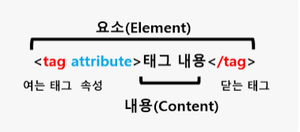

대부분의 프로그래밍 언어는 운영체제나 가상 머신 위에서 실행되지만 웹 에플리케이션의 클라이언트 사이드 자바스크립트는 브라우저에서 HTML, CSS와 함께 실행된다.

- 파싱: 해석
- 렌더링: 출력


# 브라우저에 URL을 입력하면 벌어지는 일


- 호스트 이름 (https://host.com)을 입력하면 DNS가 IP주소로 바꿔줌

- 이 IP주소를 갖는 서버에게 요청을 전송함

- 기본적으로 정적파일 index.html(assets에 있는거)을 응답한다.(https://host.com.index.html을 입력하는것과 같음)

  - 리액트는 public에 있고 src에 index.js가 있는데 이건 어떻게 처리해서 보내줄까?

    - ``` html
      index.html에 있는 <div id="root"></div> 이게 불러옴
      ```

    - 

- 파싱중에 css파일 로드하는 태그, 이미지 태그, 자바스크립트를 로드하는 태그 등을 만나면 파싱을 중단(돔 생성을 중단)하고 해당 파일을 받아옴

  - 돔을 형성하는 과정처럼 CSSOM을 형성한다
  - 쏨은 CSS의 상속을 반영해서 생성된다.

- HTTP/1.1은 기본적으로 하나의 요청에 하나의 응답을 받음(css하나 불러오고 js하나 불러오고 이런식)

- HTTP/2.0은 여러요청을 보내고 여러 응답을 받을 수 있다.

- 브라우저의 요청에 응답한 HTML은 순수 문자열임

  - 이걸 응답의 meta테그의 정보를 바탕으로 해석해서 돔(트리형태의 자료구조)을 형성함


- 이후 DOM과 CSSOM을 합쳐 렌더링을 위한 렌더트리를 형성한다.
- 렌더링을 위한 자료구조이기 때문에 meta나 script등 화면에 표시안되는 노드들은 포함하지 않음
  - 간단하게 화면에 표시되는 노드들만 포함
- 완성된 렌더트리는 각 HTML 요소의 레이아웃을 계산하는데 사용되고 이후 화면에 페인팅을 한다.
- 레이아웃 계산과 페인팅이 다시 실행되는 경우:
  - 자바스크립트에 의한 노드 추가, 삭제
  - 브라우저창 크기 변경에 의한 viewport 변경
  - HTML요소의 레이아웃 변경
  - 이 과정은 비용이 많이들기 때문에(성능에 악영향) 자주 발생하지 않게 하는게 좋다.
  - left, right 등을 사용하는거보다 transform:translate 를 쓰면 좋음
  - translate => translate3d로 바꾸면 또 더 빠름
    - GPU를 사용하기 때문
    - 레이어정보를 GPU의 비디오 메모리에도 저장되기 때문에 추가적인 메모리 점유 발생
    - 대기 중에도 비디오 메모리를 사용함
    - CPU에서 GPU 데이터 전달 과정에서 지연 시간 발생
    - 전력소모가 큼
    - will-change속성을 사용하면 대기중엔 메모리 사용을 안함

- 이 DOM을 다루는 DOM API가 있다.


- 자바스크립트 테그를 만나면 브라우저 엔진이 아닌 자바스크립트 엔진이 처리한다.
  - CPU가 이해할 수 있는 저수준 언어로 파싱함
- DOM, CSSOM을 생성하듯이 AST(Abstract Syntax Tree 추상적 구문 트리)를 생성한다.
  - 이걸 기반으로 움직임


- DOM, CSSOM, AST가 동기적으로 생성되기 때문에 오래걸리는 경우 script태그의 순서도 중요하다.
  - 예를들어 DOM트리가 생성되기 전에 스크립트에서 DOM API를 사용하면 제대로 동작하지 않는다
  - 따라서 script코드를 제일 밑에 두는게 좋다.
  - 돔이 형성되고 js를 불러와서 렌더링도 빠르다
- async, defer 어트리뷰트를 사용하면 비동기적으로 js 를 받아올 수 있다.
  - async:
    - js로드는 비동기적이지만 실행될 때 HTML파싱이 중단된다.
    - 여러 태그에 사용하면 로드되는대로 코드순서에 상관없이 실행된다.
  - defer:
    - 마찬가지로 비동기적으로 로드되지만 파싱이 완료된 직후, 즉 DOM생성이 완료된 직후에 실행된다.


# DOM



- 어트리뷰트는 어트리뷰트 노드로, 텍스트 콘텐츠는 텍스트 노드로 변환된다.
- document노드가 최상위에 있다.
- 요소노드(li, div같은)에 어트리뷰트 노드가 달려있고 요소노드 밑에 텍스트노드가 형성됨
- 어트리뷰트 노드는 부모노드랑은 연결되어있지 않고 요소노드랑만 연결되어있어서 요소를 통해 접근해야한다.(형재노드라고 볼수는 없다)(자식에 더 가까운듯)
- 텍스트노드는 요소 노드의 자식노드이고, 자식을 가질 수 없는 리프노드이다.