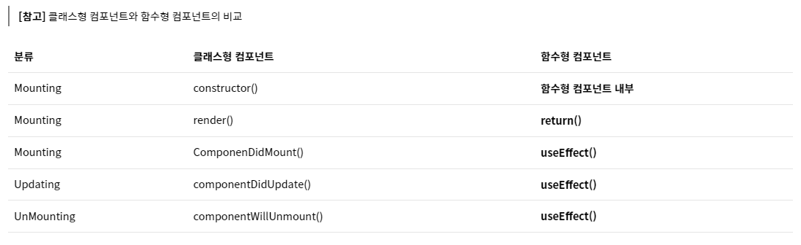

# 클래스형

- 클래스방식은 기본적으로 구체적이고 세세하다
  - 구체적인 라이프사이클
  - 스테이트 사용가능(함수형도 이제 가능)
  - 레거시코드가 클래스스타일인게 많아서 알아야됨
  - 스테이트 값이 바뀌면 렌더에 리턴이 실행됨

# 함수형

- 훅 기능이 추가되면서 많이쓰임
  - 기존에 못했던걸 할 수 있게됨(라이프사이클, 스테이트 등)

# 라이프사이클

