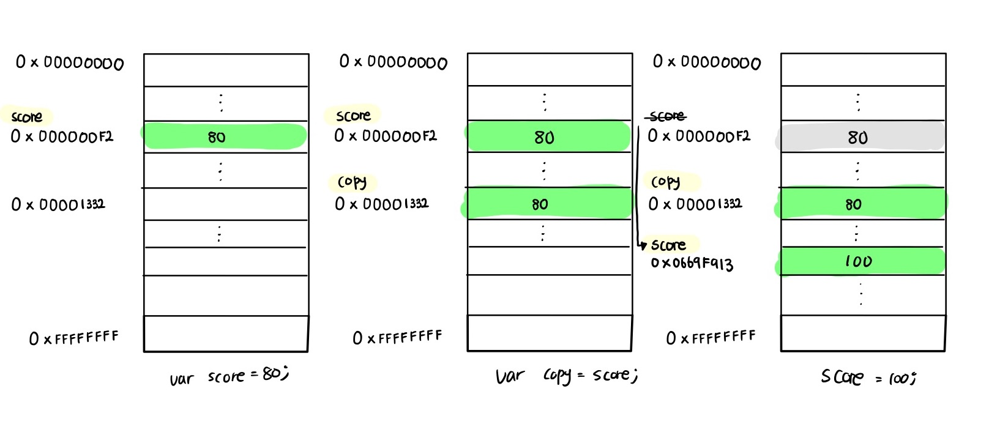

## 배열

### 자바스크립트의 배열은 자료구조의 배열과 같나요?

자료구조에서 말하는 배열은 동일한 크기의 메모리 공간이 빈틈없이 연속적으로 나열된 자료구조를 말한다.

즉, 배열의 요소는 하나의 데이터 타입으로 통일되어 있으며 서로 연속적으로 인접해 있다. 이러한 배열은 밀집 배열(dense array)이라 한다.

자바스크립트의 배열은 지금까지 살펴본 자료구조에서 말하는 일반적인 의미의 배열과 다르다.

즉, 배열의 요소를 위한 각각의 메모리 공간은 동일한 크기를 갖지 않아도 되며, 연속적으로 이어져 있지 않을 수도 있다.

배열의 요소가 연속적으로 이어져 있지 않는 배열을 희소 배열(sparse array)이라 한다.

이처럼 자바스크립트의 배열(희소 배열)은 엄밀히 말해 일반적인 의미의 배열이 아니다. 자바스크립트의 배열은 일반적인 배열의 동작을 흉내 낸 특수한 객체다.


### 배열의 메서드는 어떤 종류가 있나요?

배열은 크게 두 종류로 나눌 수 있다

- `① 원본 배열을 직접 변경하는 메서드 `
- `② 원본 배열을 직접 변경하지 않고 새로운 배열을 생성하여 반환하는 메서드`가 있다.

ES5부터 도입된 배열 메서드는 대부분 원본 배열을 직접 변경하지 않지만 초창기 배열 메서드는 원본 배열을 직접 변경하는 경우가 많다.

원본 배열을 직접 변경하는 메서드는 외부 상태를 직접 변경하는 부수효과가 있으므로 사용할 때 주의해야 한다.

가급적 원본 배열을 직접 변경하지 않는 메서드를 사용하는 편이 좋다.

```
Array.isArray 🌟
Array.prototype.indexOf 🌟
Array.prototype.push (원본 배열을 변경한다 - 부수효과 o)
Array.prototype.pop (원본 배열을 변경한다 - 부수효과 o)
Array.prototype.unshift (원본 배열을 변경한다 - 부수효과 o)
Array.prototype.shift (원본 배열을 변경한다 - 부수효과 o)
Array.prototype.concat 🌟
Array.prototype.splice 🌟 (원본 배열을 변경한다 - 부수효과 o)
Array.prototype.slice 🌟
Array.prototype.join 🌟 (원본 배열을 변경한다 - 부수효과 o)
Array.prototype.reverse 🌟 (원본 배열을 변경한다 - 부수효과 o)
Array.prototype.fill 🌟 (원본 배열을 변경한다 - 부수효과 o)
Array.prototype.includes 🌟
```

### 고차 함수에 대해서 아나요?

고차 함수(Higher-Order Function, HOF)는 함수를 인수로 전달받거나 함수를 반환하는 함수를 말한다.

자바스크립트의 함수는 일급 객체이므로 함수를 값처럼 인수로 전달할 수 있으며 반환할 수도 있다.

고차 함수는 외부 상태의 변경이나 가변(mutable) 데이터를 피하고 불변성(immutability)을 지향하는 함수형 프로그래밍에 기반을 두고 있다.

함수형 프로그래밍은 순수 함수와 보조 함수의 조합을 통해 로직 내에 존재하는 조건문과 반복문을 제거하여 복잡성을 해결하고 변수의 사용을 억제하여 상태 변경을 피하려는 프로그래밍 패러다임이다.

함수형 프로그래밍은 순수 함수를 통해 부수 효과를 최대한 억제하여 오류를 피하고 프로그램의 안정성을 높이려는 노력의 일환이라고 할 수 있다.

```
대부분의 고차 함수들은 파라미터로 콜백 함수를 받아 사용되기 때문에 원본 배열을 바탕으로 하는 새로운 결과값을 창조하는데 사용된다
Array.prototype.sort (원본 배열을 변경한다 - 부수효과 o)
Array.prototype.forEach
Array.prototype.map
Array.prototype.filter
Array.prototype.reduce
Array.prototype.some
Array.prototype.every
Array.prototype.find
```

### forEach 메서드와 map메서드의 차이점에 대해 알고 있나요?

#### forEach()

```
// forEach 메서드는 콜백 함수를 호출하면서 3개(① 요소값 ② 인덱스 ③ this)의 인수를 전달한다.
[1, 2, 3].forEach((item, index, arr) => {
  console.log(`요소값: ${item}, 인덱스: ${index}, this: ${arr}`);
});

/*
요소값: 1, 인덱스: 0, this: [1,2,3]
요소값: 2, 인덱스: 1, this: [1,2,3]
요소값: 3, 인덱스: 2, this: [1,2,3]
*/
```

#### map()

```
const numbers = [1, 4, 9];

// map 메서드는 numbers 배열의 모든 요소를 순회하면서 콜백 함수를 반복 호출한다.
// 그리고 콜백 함수의 반환값들로 구성된 새로운 배열을 반환한다.
const roots = numbers.map((item) => Math.sqrt(item));

// 위 코드는 다음과 같다.
// const roots = numbers.map(Math.sqrt);

// map 메서드는 새로운 배열을 반환한다
console.log(roots); // [ 1, 2, 3 ]
// map 메서드는 원본 배열을 변경하지 않는다
console.log(numbers); // [ 1, 4, 9 ]
```

`①forEach` 메서드와 `②map` 메서드의 공통점은 자신을 호출한 배열의 모든 요소를 순회하면서 인수로 전달받은 콜백 함수를 반복 호출한다는 것이다.

**하지만 `①forEach` 메서드는 언제나 undefined를 반환하고 `②map` 메서드는 콜백 함수의 반환값들로 구성된 새로운 배열을 반환한다는 것이다.**

즉 `forEach` 메서드는 **단순히 반복문을 대체하기 위한 고차 함수**이고 `Map` 메서드는 **요소값을 다른 값으로 매핑한 새로운 배열을 생성하기 위한 고차 함수**다.

map 메서드를 호출한 배열과 map 메서드가 생성하여 반환한 배열은 1:1 매핑한다.

forEach 메서드와 마찬가지로 map 메서드의 콜백 함수는 map 메서드를 호출한 배열의 요소값과 인덱스, map 메서드를 호출한 배열 자체, 즉 this를 순차적으로 받을 수 있다.

다시 말해, `① map` 메서드를 호출한 배열의 요소값 ② 인덱스 ③ 호출한 배열 자기 자신(this)를 순차적으로 전달한다.

## 객체 리터럴

### 자바스크립트에서 객체란 뭘까요?

자바스크립트는 객체 기반의 프로그래밍 언어이며, 자바스크립트를 구성하는 거의 '모든 것'이 객체다. 원시 값을 제외한 나머지 값(함수, 배열, 정규 표현식 등)은 모두 객체이다. 원시 타입은 단 하나의 값만 나타내지만 객체 타입은 다양한 타입의 값(원시 값 또는 다른 객체)을 하나의 단위로 구성한 복합적인 자료구조이다. 또한 원시 타입의 값, 즉 원시 값은 변경 불가능한 값이지만 객체 타입의 값, 즉 객체는 변경 가능한 값이다.

객체는 0개 이상의 프로퍼티로 구성된 집합이며, 프로퍼티는 키(key)와 값(value)으로 구성된다.

```
var person = {
  name: "Lee",
  age: 20,
};
```

### 함수와 메서드의 차이점에 대해 알고 계신가요?

자바스크립트에서 사용할 수 있는 모든 값은 프로퍼티 값이 될 수 있다. **프로퍼티 값이 함수일 경우**, 일반 함수와 구분하기 위해 메서드(method)라 부른다. 객체 내부에서 객체의 프로퍼티(상태)를 참조하고 조작할 수 있는 동작을 메서드라 부른다.

즉, **메서드는 객체에 묶여 있는 함수를 의미한다.**

```
var person = {
  name: "Lee",
  age: 20,
  hello: function () {
    console.log("hello :" + this.name);
  },
};

console.log(person);
>>>
{ name: 'Lee', age: 20, hello: [Function: hello] }
```


### 자바스크립트에서 객체를 생성하는 방법은 어떤 것들이 있나요?

자바스크립트는 **'프로토타입 기반 객체지향 언어'** 로서 **'클래스 기반 객체지향 언어'** 와는 달리 다양한 객체 생성 방법을 지원한다.

```
1.객체 리터럴
2.Object 생성자 함수
3.생성자 함수
4.Object.create 메서드
5.클래스(ES6)
```


### 전역 객체에 대해서 아나요?

- 전역 객체는 코드가 실행되기(런타임) 이전 단계에 자바스크립트 엔진에 의해 생성되는 특수한 객체다.
- 클라이언트 사이드 환경(브라우저)에서는 window, 서버 사이드 환경(Node.js)에서는 global 객체를 의미한다.
- 전역 객체는 표준 빌트인 객체(Object, String, Number, Function, Array...) 들과 환경에 따른 호스트 객체, 그리고 var 키워드로 선언한 전역 변수와 전역 함수를 프로퍼티로 갖늗다.

## 원시 값과 객체 비교

### 동적 타이핑을 지원하는 자바스크립트에서 데이터의 타입을 크게 2개로 나누는 이유가 있을까요?

1. 원시 타입의 값, 즉 원시 값은 변경 불가능한 값(immutable value)이다. 이에 비해 객체(참조)타입의 값, 즉 객체는 변경 가능한 값(mutable value)이다.
2. 원시 값을 변수에 할당하면 변수(확보된 메모리 공간)에는 실제 값(100, 실제로는 2진수)이 저장된다. 이에 비해 객체를 변수에 할당하면 변수(확보된 메모리 공간)에는 참조 값(메모리 주소, 0x00000613)이 저장된다.
3. 원시 값을 갖는 변수를 다른 변수에 할당하면 원본의 원시 값이 복사되어 전달된다. 이를 값에 의한 전달이라 한다. 이에 비해 객체를 가리키는 변수를 다른 변수에 할당하면 원본의 참조 값(메모리 주소, 0x00000613)이 복사되어 전달된다. 이를 참조에 의한 전달이라 한다.


### 값에 의한 전달이 뭔가요?

변수에 원시 값을 갖는 변수를 할당하면 할당받는 변수(copy)에는 할당하는 변수(score)의 원시 값이 복사되어 전달된다. 이를 **'값에 의한 전달'** 이라 한다.

```
var score = 80;

// copy 변수에는 score 변수의 값 80이 복사되어 할당된다.
var copy = score;

console.log(score, copy); // 80  80
console.log(score === copy); // true

// score 변수와 copy 변수의 값은 다른 메모리 공간에 저장된 별개의 값이다.
// 따라서 score 변수의 값을 변경해도 copy 변수의 값에는 어떠한 영향도 주지 않는다.
score = 100;

console.log(score, copy); // 100  80
console.log(score === copy); // false
```

score 변수와 copy 변수의 값 80은 다른 메모리 공간에 저장된 별개의 값이라는 것에 주의하기 바란다. 따라서 score 변수의 값을 변경해도 copy 변수의 값에는 어떠한 영향도 주지 않는다.

[](https://github.com/junh0328/prepare_frontend_interview/blob/main/images/11_4.jpg)


### 참조에 의한 전달이 뭔가요?

객체는 프로퍼티의 개수가 정해져 있지 않으며, 동적으로 추가되고 삭제할 수 있다. 또한 프로퍼티의 값에도 제약이 없다. 따라서 객체는 원시 값(문자열 2바이트*문자, 숫자 8바이트)과 같이 확보해야 할 메모리 공간의 크기를 사전에 정해 둘 수 없다. 이러한 객체의 가변성의 성질 때문에 객체를 할당한 변수가 기억하는 메모리 주소를 통해 메모리 공간에 접근하면 참조 값에 접근할 수 있다. 참조 값은 생성된 객체가 저장된 메모리 공간의 주소, 그 자체이다.

```
var person = {
  name: "Lee",
};

// 참조값을 복사(얕은 복사)
var copy = person;
```

객체를 가리키는 변수(원본, person)를 다른 변수(사본, copy)에 할당하면 원본의 참조 값이 복사되어 전달된다. 이를 **'참조에 의한 전달'** 이라 한다.

[](https://github.com/junh0328/prepare_frontend_interview/blob/main/images/11_9.jpg)


## 함수

### 자바스크립트에서 함수를 정의하는 방법은 몇가지가 있나요?

1. 함수 선언문
2. 함수 표현식
3. Function 생성자 함수
4. 화살표 함수 (ES6)

```
case 1 :함수 선언문

function add(x,y){
  return x+y;
}

case 2: 함수 표현식
var add = function(x,y){
  return x + y;
}

case 3: Function 생성자 함수
var add = new Function('x','y', 'return x+y');

case 4: 화살표 함수(ES6)
var add = (x,y) => x+y;
```

### 함수 선언문과 함수 표현식은 어떤 차이가 있나요?

```
// 함수 참조
console.dir(add); // ƒ add(x, y)
console.dir(sub); // undefined

// 함수 호출
console.log(add(2, 5));
// 7 why? 함수 선언문은 표현식이 아닌 문으로, 런타임 이전에 js 엔진에 의해 실행된다.

console.log(sub(2, 5));
// TypeError: sub is not a function, why? 함수 표현식(표현식인 문)은 런타임에 값을 할당하기 때문에 sub는 현재 undefined로만 초기화된 상태이다.

// ① 함수 선언문
function add(x, y) {
  return x + y;
}

// ② 함수 표현식
var sub = function (x, y) {
  return x - y;
};
```

코드가 한 줄씩 순차적으로 실행되기 시작하는 런타임에는 이미 함수 객체가 생성되어 있고 함수 이름과 동일한 식별자에 할당까지 완료된 상태이다. 따라서 함수 선언문의 소스코드가 평가되고 실행되기 이전에 함수를 참조할 수 있으며 호출할 수도 있다. 이처럼 **함수 선언문이 코드의 선두로 끌어 올려진 것처럼 동작하는 자바스크립트 고유의 특징을 함수 호이스팅**이라 한다.

변수 호이스팅에 의해 var 키워드로 선언된 함수 표현식은 undefined로 초기화되고, **함수 선언문을 통해 암묵적으로 생성된 식별자는 함수 객체로 초기화된다.** 따라서 var 키워드를 사용한 변수 선언문은 이전에 변수를 참조하면 변수 호이스팅에 의해 undefined로 평가되지만, **함수 선언문으로 정의한 함수를 함수 선언문 이전에 호출하면 함수 호이스팅에 의해 호출이 가능하다.**


### 즉시 실행 함수(IIFE)에 대해 알고 있나요? 알고 있다면 아는 내용에 대해 말해보세요

1. **함수 정의와 동시에 즉시 호출되는 함수를 즉시 실행 함수 (IIFE, Immediately Invoked Function Expression)** 라고 한다. 즉시 실행 함수는 단 한 번만 호출되며 다시 호출할 수 없다.

```
//익명 즉시 실행함수
(function () {
  var a = 3;
  var b = 5;
  return a * b;
})();
```

1. 즉시 실행 함수는 함수 이름이 없는 익명 함수를 사용하는 것이 일반적이다. 함수 이름이 있는 기명 즉시 실행 함수도 사용할 수 있다. 하지만 즉시 실행 함수를 다시 호출할 수는 없다.

```
//기명 즉시 실행 함수
(function foo() {
  var a = 3;
  var b = 5;
  return a * b;
})();

foo(); //ReferenceError: foo is not defined
```

1. 즉시 실행 함수는 반드시 그룹 연산자 (...)로 감싸야 한다.

```
function () {
 //SyntaxError: Function statements require a function name
...
}
```

함수 정의가 함수 선언문의 형식에 맞지 않기 때문이다. > 그룹 연산자로 함수를 묶은 이유는 먼저 함수 리터럴을 평가해서 함수 객체를 생성하기 위해서다