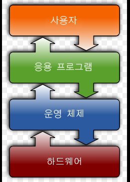

# 운영체제

## 운영체제의 목적

* 
* 컴퓨터 시스템의 자원을 효율적으로 관리, 컴퓨터 시스템을 편리하게 사용할 수 있는 환경을 제공.
  * 프로세서, 기억장치, 입출력 장치 등의 자원(리소스)을 관리
* 프로세스, 파일, 메시지 등의 소프트웨어 자원 또한 관리한다.
* 결과적으로 여러 계산을 효율적인 순서로 배치해 사용자 또는 프로그램들이 각각 독자적인 컴퓨터에서 수행되는것 같은 환상을 제공한다.
* 하드웨어를 직접 다루는 일을 대신 해줌.

## 운영체제의 분류

* 동시작업 가능 여부

  * 단일작업
    * 한번에 하나의 작업만 처리(DOS의 경우 한 명령의 수행을 끝내기 전에 다른 명령을 수행시킬 수 없다.)
  * 다중작업
    * 동시에 두개 이상의 작업을 처리(현재 사용되고 있는 거의 모든 운영체제, 여러 프로그램, 명령을 동시에 수행 가능)

  

* 사용자의 수

  * 단일 사용자

    * DOS, Window등 

  * 다중 사용자

    * UNIX, NTserver등과 같이 여러 사용자가 계정을 만들어 사용할 수 있는것
    * 보안, 사용자 간의 작업 형평성 등을 추가적으로 고려해야 한다.

    

* 처리 방식

  * 일괄처리
    * 작업 요청의 일정량을 모아서 한꺼번에 처리한다.(현대에는 잘 사용하지 않음)
    * 작업이 완전 종료될 때 까지 기다려야함
    * 천공카드 같이 비교적 원시적

  * 시분할
    * 여러 작업을 수행할 때 컴퓨터 처리 능력을 일정한 시간 단위로 분할해 사용.(대부분 현대 pc, 모바일에서 사용)
    * 일괄처리 시스템에 비해 짧은 응답시간을 가짐
    * interactive한 방식
    * 시간의 재약조건을 만족하지는 않음.(ex. 사용자가 많아짐에 따라 응답시간이 달라질 수 있다.)
  * 실시간
    * 정해긴 시간 안에 어떠한 일이 반드시 종료됨이 보장되어야 하는 시스템을 위한 os.
    * Hard realtime system
      * 원자로, 공장 제어, 미사일 제어, 반도체 장비, 로보트 제어 등 매우 중요한 일에 적용
    * Soft realtime system
      * 영화 로딩의 데드라인을 지켜 끊김 없이 사용자에게 제공하는 것과 같이 비교적 가벼운 목적의 실시간 운영 시스템
    * 네비게이션 등 실시간성이 중요한 SW가 많아짐에 따라 많이 연구중임

## 용어

* Multitasking:
  * cpu가 시간 프레임을 쪼개 각 시간을 서로 다른 프로그램에 할당해 한 프로그램이 끝나기 전에 다른 프로그램을 실행 가능한 것.
* Multiprogramming:
  * 메모리에 여러 프로그램이 올라갈 수 있는것. Multitasking을 위해선 Multiprograming이 필수적임.
  * 메모리적인 부분을 강조하는 용어.
* Time sharing:
  * cpu의 시간을 분할해 나누어 쓴다는 의미를 강조한 용어.
* Multiprocess:
  * 위의 용어들과 유사함.
* **Multiprocessor:
  * 하나의 컴퓨터에 cpu(processor)가 여러개 붙어 있음을 의미.
  * 하나의 cpu가 시간을 쪼개 사용하는것이 아닌 진짜 여러개의 cpu가 작업을 진행.

## 운영체제의 예시

* UNIX
  * 여러 사용자가 동시에 사용가능하게 만듦
  * 대부분 c로 작성됨
    * 이식성이 높음
  * Linux와 같이 개인pc에서도 사용하기 좋은 운영체제 처럼 여러 다양한 버전이 무료로 공개되어있다.
* Window
  * 다중 작업용 GUI기반 운영 체제
  * 풍부한 지원 소프트웨어

## 운영체제의 구조

